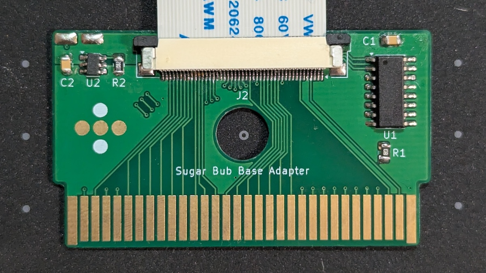
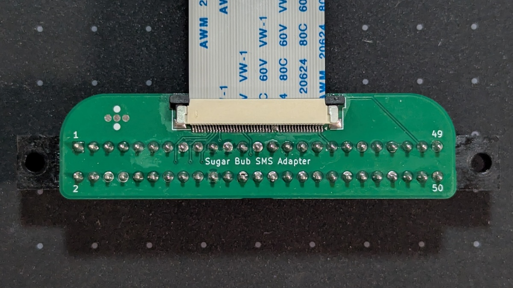

Sugar Bub Adapters
==================

.. contents::

Cartridge Hardware
------------------

Cartridge hardware is built around a 45-pin FPC cable. One end connects to a cartridge-type PCB:

* `Base Adapter`_
* `GG Adapter`_

The other end connects to a slot-type PCB:

* `RetroSix GameSlot`_
* `SMS Adapter`_
* `SG-1000 Adapter`_

.. _RetroSix GameSlot: https://retrosix.co.uk/Game-Gear-GameSlot-Kit-p515558760

Base Adapter
~~~~~~~~~~~~

The base adapter can be inserted into a Game Boy cartridge slot. It adapts the Game Boy cartridge interface to a FPC connector with the same pinout mapping as the `Analogue AP-A01`_ Sega Game Gear adapter. This FPC connector can be connected directly to a `RetroSix GameSlot`_ or the Sugar Bub `SMS Adapter`_.

By harvesting the MCU from an AP-A01, the adapter can be made compatible with the `Analogue Pocket`_. However, without harvesting the MCU_ or reverse-engineering its communication protocol, the Pocket will not recognize the adapter.

.. _Analogue AP-A01: https://github.com/sfiera/pocket-adapters/blob/main/gg.md
.. _Analogue Pocket: https://www.analogue.co/pocket
.. _MCU: https://github.com/sfiera/pocket-adapters/blob/main/mcu.md

PCB requirements:

* ENIG or hard gold finish (not HASL)
* 0.8mm thickness

Components:

* Amphenol F32Q-1A7H1-11045 FPC connector (45p, 0.5mm pitch)
* FPC cable (45p, 0.5mm pitch)
* SOIC-16 HC139 demux
* 0.1uF 0805 SMD capacitor
* (optional) MCU from Analogue AP-A01
* (optional) 0.1uF 0805 SMD capacitor
* (optional) 1.2k 0805 SMD resistor
* (optional) 10k 0805 SMD resistor
* (optional) 0402 IR LED

SMS Adapter
~~~~~~~~~~~

In combination with the `base adapter`_, the SMS adapter serves as a `Master Gear Converter`_ without the need of an intermediate Game Gear slot.

.. _Master Gear Converter: https://segaretro.org/Master_Gear_Converter

PCB requirements:

* Any finish
* Any thickness

Components:

* Amphenol F32Q-1A7H1-11045 FPC connector (45p, 0.5mm pitch)
* EDAC 395-050-521-802 edge connector (50-pin, 2.54 mm pitch)

SG-1000 Adapter
~~~~~~~~~~~~~~~

.. warning:: Untested!

In combination with the `base adapter`_, the SG-1000 adapter serves as a `Master Gear Converter`_ for Japanese cartridges without the need of an intermediate Game Gear slot or region converter.

PCB requirements:

* Any finish
* Any thickness

Components:

* Amphenol F32Q-1A7H1-11045 FPC connector (45p, 0.5mm pitch)
* EDAC 346-044-560-204 edge connector (44-pin, 3.175mm pitch)

GG Adapter
~~~~~~~~~~

The GG adapter can be inserted into a Game Gear cartridge slot. It adapts the Game Gear cartridge interface to a FPC connector with the same pinout. This FPC connector can be connected to the Sugar Bub `SMS Adapter`_ to serve as a `Master Gear Converter`_.

Note that the +34V pin is left unconnected. This pin is used only by the TV Tuner.

PCB requirements:

* ENIG or hard gold finish (not HASL)
* 1.0mm thickness

Components:

* Amphenol F32Q-1A7H1-11045 FPC connector (45p, 0.5mm pitch)

Link Hardware
-------------

Link hardware is built around a classic `Macintosh printer cable`_. Like the `Gear-to-Gear cable`_, this is an 8-core cable with 3 crossover pairs. Unlike the Gear-to-Gear cable, it uses a standard 8-pin Mini-DIN connector.

.. _Macintosh printer cable: https://whitefiles.org/tec/pgs/h10b.htm
.. _Gear-to-Gear cable: https://segaretro.org/Gear-to-Gear_Cable

GG Link Adapter
~~~~~~~~~~~~~~~

.. warning:: Untested!

The GG link adapter plugs into a `Master Link Cable`_, which in turn plugs into a Game Gear’s EXT port in place of a Gear-to-Gear cable.

.. _Master Link Cable: https://segaretro.org/Master_Link_Cable

Pmod Link Adapter
~~~~~~~~~~~~~~~~~

.. warning:: Untested!

The Pmod link adapter plugs into the Pmod connector on top of a `Game Bub`_. It also requires connection to the link port by a Game Boy (not GBA) link cable.

.. _Game Bub: https://gamebub.net/

Q&A
---

Q: What hardware is compatible with the `Base Adapter`_?
  A: Compatible hardware currently includes:

  * `Analogue Pocket`_, which can play games if U2 is harvested from an `Analogue AP-A01`_
  * `GBxCart RW`_, which can use cartload_ to back up cartridges

  Support is planned for `Game Bub`_.

.. _GBxCart RW: https://www.gbxcart.com/
.. _cartload: https://cartload.org/

Q: Is there any further documentation of the Analogue Pocket adapters?
  A: Yes, see `sfiera/pocket-adapters`_.

.. _sfiera/pocket-adapters: https://github.com/sfiera/pocket-adapters
